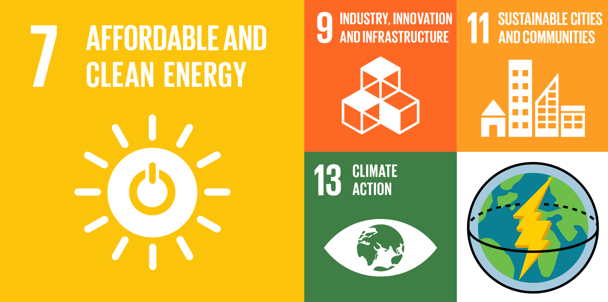
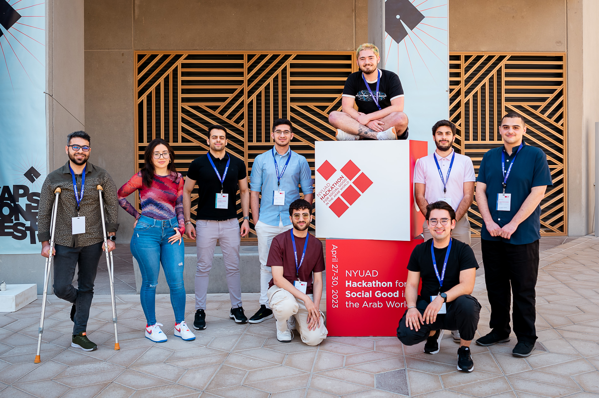

  

**TANABU|تنبّؤ** uses quantum machine learning to predict energy grid failures and suggests maintenance based on climate, consumption trends, and energy generation data.

## ✅ Targeted UN SDGs

  

## 📕 Project Description

Tanabu is an open-source Python package that utilizes quantum machine learning to enhance the accuracy in predicting maintenance of energy grids. Specifically, Tanabu uses a quantum support vector regressor algorithm to take in energy consumption trends and climate data to recommend maintenance in anticipation of potential strain on energy grids.

## 🌍 About us

  

